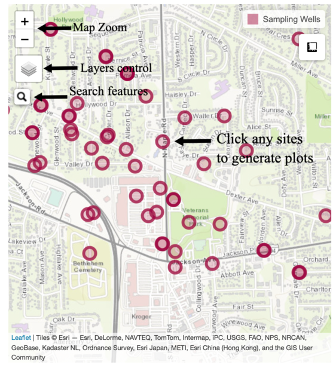

## Background
Gelman Sciences Inc. (now Pall Life Sciences), a former medical filter manufacturer near Ann Arbor, Michigan, left contamination stemming from 1966 to 1986 of unregulated waste handling on its facility grounds. A plume of 1,4-dioxane has spread through the groundwater in Ann Arbor and Scio Townships, including the western part of the city of Ann Arbor. Ex-situ remediation technologies such as pump-and-treat with advanced oxidation processes, are the primary methods employed to treat 1,4-dioxane contaminated aquifers. Extracted water containing 1,4-dioxane is mixed with hydrogen peroxide and ozone, or exposed to ultraviolet light, to break the carbon bonds (Zenker et al., 2003). Despite varying levels of cleanup efforts since the early 1990’s, the groundwater contamination has continued to spread into a plume that is now roughly four miles long and one mile wide in a densely populated area and is in some cases venting to surface water. In addition, treated water containing low levels of 1,4-dioxane as well as bromate produced in the treatment process are also being discharged to surface water in Scio Township.

1,4-dioxane is classified as a Group B2 probable human carcinogen (USEPA, 2006), and it also causes kidney and liver damage, and respiratory problems. When released into groundwater, its high miscibility and low retardation factor limit the ability of processes such as sorption to attenuate 1,4-dioxane concentrations as plumes migrate (USEPA, 2017). Until recently, researchers thought that its molecular structure also made it resistant to biodegradation (DiGuiseppi et al., 2016); consequently, 1,4-dioxane is considered a persistent contaminant of concern.

For more information related to this project, please see [Gelman Sciences, Inc. Site of Contamination Information Page](https://www.michigan.gov/egle/0,9429,7-135-3311_4109_9846-71595--,00.html)
 

## Introduction
This application is designed to interactively visualize the EGLE Gelman Sciences recent analytical data and establish a platform to provide historic and current information related to the investigation and remediation of the 1,4-dioxane groundwater contamination in Scio Township and the west part of the City of Ann Arbor in Washtenaw County.

Source code and additional information for this application are available via the [Yifan's GitHub repository](https://github.com/luo-yifan/Gelman-Plume-Analysis) .  

 

## Data
All data used by this application are available through either [Scio Residents for Safe Water (SRSW) website](https://sites.google.com/site/srsworg/srsw-org/data) or [EGLE Gelman Sciences Recent Analytical Data Monitoring Well Results](https://www.michigan.gov/egle/0,9429,7-135-3311_4109_9846_30022-71616--,00.html).

Monitoring wells are used to sample the groundwater elevations to help determine groundwater flow direction, and monitor the levels of dioxane in the water. The monitoring wells at the Gelman site are tested monthly, quarterly, twice a year or once a year depending on their location. Gelman conducts the sampling and testing of the OVER 250 monitoring wells following Michigan Department of Environment, Great Lakes and Energy (EGLE) approved sampling plans. EGLE samples selected wells with Gelman on a quarterly basis and submits the samples to the EGLE Laboratory for analysis.

The determination of 1,4-dioxane concentration in drinking water is carried out following US EPA Method 522, by using solid phase extraction (SPE) and gas chromatography/mass spectrometry (GC/MS) with selected ion monitoring (SIM) (Chiang et al., 2016). Method 522 was adapted as the analytical method for dioxane analyses under UCMR3. It is worth noting that this method does not require correction for the recovery rate as well, although the rates are generally much higher than with Method 8270.
 

### Detailed Description of Each Measured Variables
Well Name: Name of wells used for monitoring groundwater contamination.

Longitude/Latitude: Longitude and Latitude are geographic Cartesian coordinates for a sampling well location. 

Depth: Boring depth measured in feet height below ground level (bgl). Bored wells are usually constructed where aquifers are both shallow and low-yielding. Boring depth means the distance from the ground surface to the bottom of the well screen or to the bottom of the open hole when a well screen is not used.

Elevation: Top of Casing (TOC) elevation measured in feet height above mean sea level (amsl). The casing is a tube in the ground that houses the well pump and the pipe that moves water from the pump to the surface.

1,4-dioxane concentration: measured in parts per billion (ppb), and the detectable level for 1,4-dioxane is 1 ppb. The EPA defined a concentration of 0.35 ppb. as the amount of the chemical in water is expected to cause no more than one additional case of cancer in every one million people who drink it for a lifetime.
 

## Application usage
The application has two main inputs: a map and a table. To build plots for any individual sampling well, click on your desired well in either the map or the table.  

The map shows all wells with concentration data available. The table shows all of those wells and their associated geographic information and dioxane concentration.  

The map and table inputs are responsive to each other. When you click a well on the map, the table will automatically filter to assessments associated with that well. When you click on a row in the table, the map will automatically fly to that well location.  

Plots specific to that well will be rendered automatically. Several data plotting and review options are available.
Outputs will automatically render any time the user updates one of the input widgets.
 

### Map elements
Individual monitoring locations are displayed as circle markers on the map. In addition to displaying wells, well labels and polygons identifying assessment unit, beneficial use, and well-specific standard boundaries are also available. Topographic and satellite base layers are both available. 

To turn on any of these layers, hover the mouse over the layers control box (top left of map, under zoom buttons) and select one or more layers.

Features are searchable by well and assessment unit names or identifier codes. To search for a feature, click the magnifier glass (top left of map, under the layers control box) and start topping.
Locations matching your search will appear as you type.  

  
Figure 1. Map usage guide.
 

### Table output
The "Time series" tab shows three outputs summarizing patterns in dioxane concentration across time at the selected well. I labelled the x-axis the time-axis, and the y-axis is for the 1,4 dioxane plume concentration. So we can see any trends of dioxane concentration and predict its transportation and transformation path, to better identify the areas that need additional attention, and provide decision support for the administrators of drinking water safety, water environment protection, and emergency response.
 

## Package dependencies & credits
This application depends on functions contained within [DWQ wqTools R-package](https://github.com/utah-dwq/wqTools). Code was adapted from [Utah DWQ Lake Profile Dashboard](https://github.com/rstudio/shiny-gallery/tree/master/lake-profile-dashboard) developed by [Jake Vander Laan](https://github.com/jakevl).
 

## Help & feedback
For additional help or to submit feedback or bug reports, please contact:  
Yifan Luo

University of Michigan School for Environment and Sustainability 

yifanluo@umich.edu  
 

