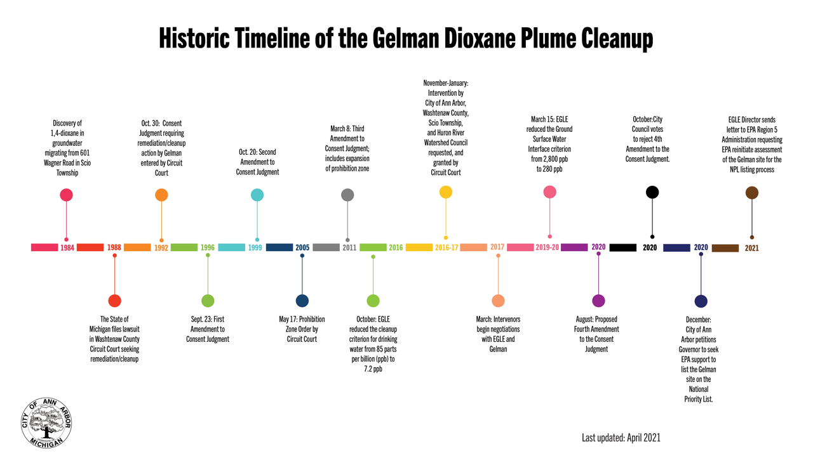
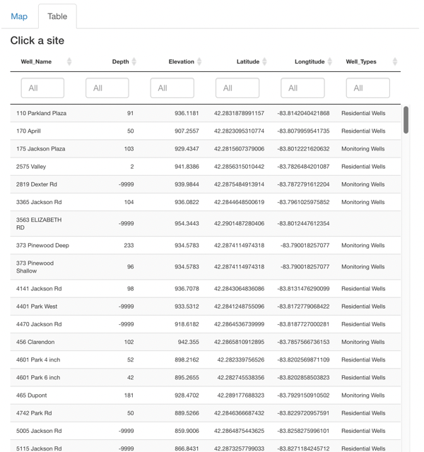
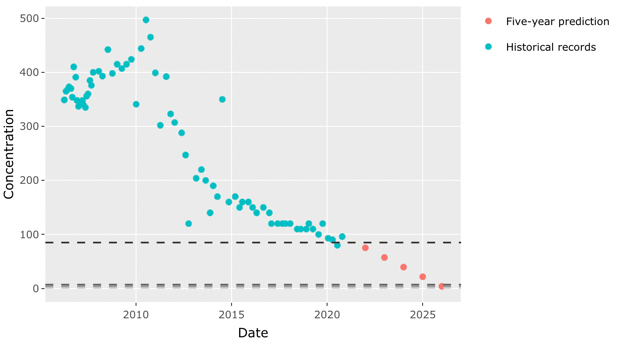

## Background
Gelman Sciences Inc. (now Pall Life Sciences), a former medical filter manufacturer near Ann Arbor, Michigan, left contamination stemming from 1966 to 1986 of unregulated waste handling on its facility grounds. A plume of 1,4-dioxane has spread through the groundwater in Ann Arbor (Figure 1). It was first discovered in Third Sister Lake and nearby water wells in the fall of 1985 and a comprehensive site investigation started later in 1986. The topography of this area ranges from 940 feet above mean sea level in the vicinity of the Gelman property to the lower area of approximately 850 feet at Honey Creek. There are currently over 250 monitoring and extraction wells located in and around the plume used to track water levels and dioxane concentrations, which are being used in this study. Groundwater within an area of approximately 8.97 square miles (23.23 square kilometers) has been affected by 1,4-dioxane within four townships: Scio, Lodi, Pittsfield, and Ann Arbor Township. Northing and Easting values range from 274,919.1 to 293,267.4 and 13,264,780.9 to 13,291,717.6 feet, respectively.

 

Figure 1. Map of plume impacted area showing the location of the Gelman Sciences source area and prohibition zones
 

Ex-situ remediation technologies such as pump-and-treat with advanced oxidation processes are the primary methods employed to treat 1,4-dioxane contaminated aquifers. Extracted water containing 1,4-dioxane is mixed with hydrogen peroxide and ozone, or exposed to ultraviolet light, to break the carbon bonds. Despite varying levels of cleanup efforts since the early 1990’s, the groundwater contamination has continued to spread into a plume that is now roughly four miles long and one mile wide in a densely populated area and is in some cases venting to surface water. In addition, treated water containing low levels of 1,4-dioxane and bromate produced in the treatment process are also being discharged to surface water in Scio Township.

1,4-dioxane is classified as a Group B2 probable human carcinogen, and it also causes kidney and liver damage and respiratory problems. When released into groundwater, its high miscibility and low retardation factor limit the ability of processes such as sorption to attenuate 1,4-dioxane concentrations as plumes migrate. Until recently, researchers thought that its molecular structure also made it resistant to biodegradation; consequently, 1,4-dioxane is considered a persistent contaminant of concern. 

In the state of Michigan, the Residential Drinking Water Criterion was set to 85 parts per billion (ppb), one of the highest standards in the country. After new EPA data about dioxane came out in 2010, the Michigan Department of Environmental Quality (MDEQ) proposed generic residential cleanup criteria for drinking water for 1,4-dioxane of 7.2 ppb based on 1 in 100,000 additional cancer risk in 2016. However, several of these wells continue to exceed the revised Michigan standard by more than 1,000 ppb, with the sampled recent five-year highest concentration of 19,000 ppb from well MW-5d on Oct 5, 2017.

Monitoring wells are used to sample the groundwater elevations to help determine groundwater flow direction and monitor the levels of dioxane in the water. The monitoring wells at the Gelman site are tested monthly, quarterly, twice a year, or once a year, depending on their location. Gelman conducts the sampling and testing of over 250 monitoring wells following Michigan Department of Environment, Great Lakes and Energy (EGLE) approved sampling plans.  EGLE samples selected wells with Gelman quarterly and submitted the samples to the Laboratory for analysis.

 

Figure 2. Historical timeline of the Gelman dioxane plume cleanup
 

For more information related to this project, please see [Gelman Sciences, Inc. Site of Contamination Information Page](https://www.michigan.gov/egle/0,9429,7-135-3311_4109_9846-71595--,00.html)
 

## Introduction
This application is designed to interactively visualize the EGLE Gelman Sciences' recent analytical data and establish a platform to analyze the historical trends of dioxane concentration and estimate its future temporal and spatial change in Scio Township and the west part of the City of Ann Arbor in Washtenaw County. The goal of this application is for users to view the data to better identify the areas that need additional attention and provide decision support for the administrators of drinking water safety, water environment protection, and emergency response.

Source code and additional information for this application are available via the [Yifan Luo's GitHub repository](https://github.com/luo-yifan/gelman_shiny) . 
 

## Data
All data used by this application are available for viewing in table format or for download at [Scio Residents for Safe Water (SRSW) website](https://sites.google.com/site/srsworg/srsw-org/data) or [EGLE Gelman Sciences Recent Analytical Data Monitoring Well Results](https://www.michigan.gov/egle/0,9429,7-135-3311_4109_9846_30022-71616--,00.html). For more information related to this project, please see the [Gelman Sciences, Inc. Site of Contamination Information Page](https://www.michigan.gov/egle/0,9429,7-135-3311_4109_9846-71595--,00.html).
 

## Application usage
The application has two main inputs: a map and a table. To build plots for any individual sampling well, click on your desired well in either the map or the table. The map shows all wells with concentration data available, while the table shows all of those wells and their associated geographic information and dioxane concentration. The map and table inputs are responsive to each other. When you click a well on the map, the table will automatically filter to assessments associated with that well. When you click on a row in the table, the map will automatically fly to that well location. 

Output includes a time series plot and spatial movement animation specific will automatically render any time the user updates one of the input widgets. Several data plotting and review options are available.
 

### Map elements
Individual monitoring locations are displayed as circle markers on the map. In addition to displaying well sites, well labels are also available. Topographic and satellite base map layers are both available. To turn on any of these layers, hover the mouse over the layers control box (top left of map, under zoom buttons) and select one or more layers.

Features are searchable by well names. To search for a well, click the magnifier glass (top left of map, under the layers control box) and start typing in a street address or well name. Locations matching your search will appear as you type. 

The Map zoom +/- buttons (represented by a plus sign and a minus sign with a gray background) at the top left corner can be used to zoom in or out of the map. Alternately, your mouse wheel also lets you zoom in and out, while left-clicking and dragging lets you pan around the map.

The Layers control button (represented by a stack of three squares) displays a key of the symbols used on the map. It also lets you choose which information you want to see. Click the checkbox for a layer that will turn that layer on or off on the map. A topographic or satellite base map lets you choose what your background map looks like.

The Search feature button (represented by a magnifier) lets you search for a street address or well name.

The Measure button (represented by two horizontally overlapping rulers) at the top right corner lets you measure distances or areas between features on the map. Click the map where you want to start the measurement, and click once for every vertex of the line/area you want to measure. Double-click to complete the line/area.

 

Figure 3. Map element usage guide
 

### Table input
The Search bar (represented by a white box with light grey text reading All) at the top lets you search for a well name, well type, or any range of depth, elevation, latitude, and longitude. 

 

Figure 4. Table input usage guide
 

#### Detailed description of each measured variables
Well Name: Name of wells used for monitoring groundwater contamination.

Latitude/Longitude: Latitude and Longitude are geographic Cartesian coordinates for a sampling well location. 

Depth: Boring depth measured in feet height below ground level (bgl). It means the distance from the ground surface to the bottom of the well screen or the bottom of the open hole when a well screen is not used.

Elevation: Top of Casing (TOC) elevation measured in feet height above mean sea level (amsl). The casing is a tube in the ground that houses the well pump and the pipe that moves water from the pump to the surface.

Well type: Includes Monitoring, Residential, Extraction and Miscellaneous Wells.

1,4-dioxane concentration: measured in parts per billion (ppb), and the detectable level for 1,4-dioxane is 1 ppb. The EPA defined a concentration of 0.35 ppb as the amount of the chemical in water is expected to cause no more than one additional case of cancer in every one million people who drink it for a lifetime. 
 

### Time series plot output
The "time series" tab shows plots summarizing patterns in dioxane concentration across time at the selected well. I labeled the x-axis the time-axis, and the y-axis is for the 1,4 dioxane plume concentration. So we can see any trends of historical dioxane concentration and predict future contamination level change in five years. There are four horizontal lines of 1, 4, 7.2, and 85 ppb with different shades of grey, which represent: the detectable level, a new trigger for a response if detected in sentinel wells, the current EGLE Part 201 generic residential cleanup criterion (GRCC), the Consent Judgement 3 (CJ3) drinking water criteria.

 

Figure 5. Time series plot output usage guide
 

### Spatial movement animation 
This spatial movement animation shows historical and forecasting groundwater pollutant transportation over time. A time slider is set up to move through each month/year. Once hit the Play button on the bottom right of the time slider (represented by a triangle pointing to the right), the spatial distribution will automatically move through time. While playing, the Pause button (represented by two vertical lines) appears in its place. The value control dot (represented by a white dot in between) can be dragged along the slider bar to set the map time interactively. The dark red color represents areas of high plume concentration, and the color bright yellow shows regions where the dioxane level is relatively low. 

 

Figure 6. Spatial movement animation output usage guide
 

## Package dependencies & credits
This application depends on functions contained within [DWQ wqTools R-package](https://github.com/utah-dwq/wqTools). Code was adapted from [Utah DWQ Lake Profile Dashboard](https://github.com/rstudio/shiny-gallery/tree/master/lake-profile-dashboard) developed by [Jake Vander Laan](https://github.com/jakevl). Special thanks to R packages leaflet, plotly, raster and Shiny.
 

## Disclaimer & feedback
The information contained in this application is for general information purposes only and should not be used for navigation, regulatory, permitting, or other legal purposes. We have used our reasonable efforts to ensure that the data analysis we release is complete, accurate, and useful. However, because we do not create the data and because the processing required to make the data useful is complex, we cannot be liable for omissions or inaccuracies. Both the time series and spatial movement prediction are provided "as is." And some uncertainty and limitation are associated with this data analysis, which will be described in detail in the report.

For additional help or to submit feedback or bug report, please contact: 

Yifan Luo

University of Michigan, School for Environment and Sustainability

yifanluo@umich.edu 

(734)834-2596

 